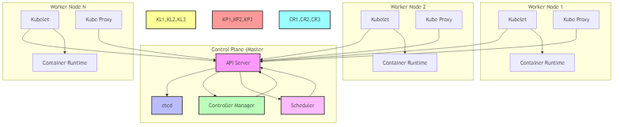

# Kubernetes Architecture

This section covers the core components and architecture of Kubernetes.

## Overview

Kubernetes follows a master-worker architecture, also known as control plane and data plane. Below is a high-level diagram of the Kubernetes architecture:

## Components

### Control Plane (Master Node)
The control plane manages the worker nodes and the Pods in the cluster. It includes:

1. **API Server**
   - Primary entry point for all REST commands
   - Validates and processes requests
   - See [api-server.md](master-components/api-server.md)

2. **etcd**
   - Distributed key-value store
   - Stores all cluster data
   - See [etcd.md](master-components/etcd.md)

3. **Controller Manager**
   - Runs controller processes
   - Manages node lifecycle
   - See [controller-manager.md](master-components/controller-manager.md)

4. **Scheduler**
   - Assigns Pods to Nodes
   - Makes scheduling decisions
   - See [scheduler.md](master-components/scheduler.md)

### Worker Nodes
Worker nodes host the applications as containers. Each node includes:

1. **Kubelet**
   - Node agent that runs on each node
   - Ensures containers are running in a Pod
   - See [kubelet.md](worker-components/kubelet.md)

2. **Kube Proxy**
   - Network proxy on each node
   - Maintains network rules
   - See [kube-proxy.md](worker-components/kube-proxy.md)

3. **Container Runtime**
   - Software for running containers
   - Usually Docker or containerd
   - See [container-runtime.md](worker-components/container-runtime.md)

## Component Interaction
For detailed information about how these components interact with each other, see:
- [Component Interaction](component-interaction/README.md)
- [Component Interaction Diagram](component-interaction.yaml)

## Further Reading
- [Official Kubernetes Documentation](https://kubernetes.io/docs/concepts/overview/components/)
- [Kubernetes Architecture Explained](https://kubernetes.io/docs/concepts/architecture/)
