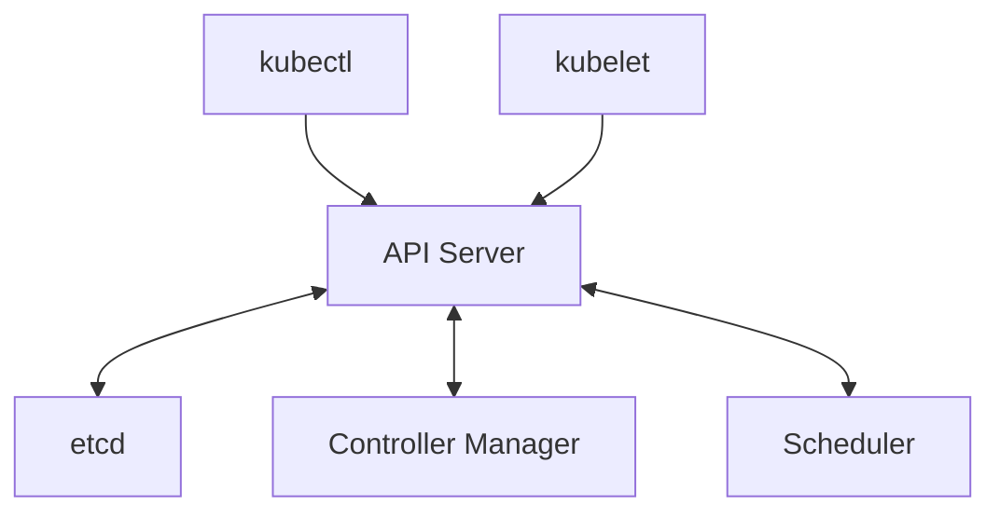
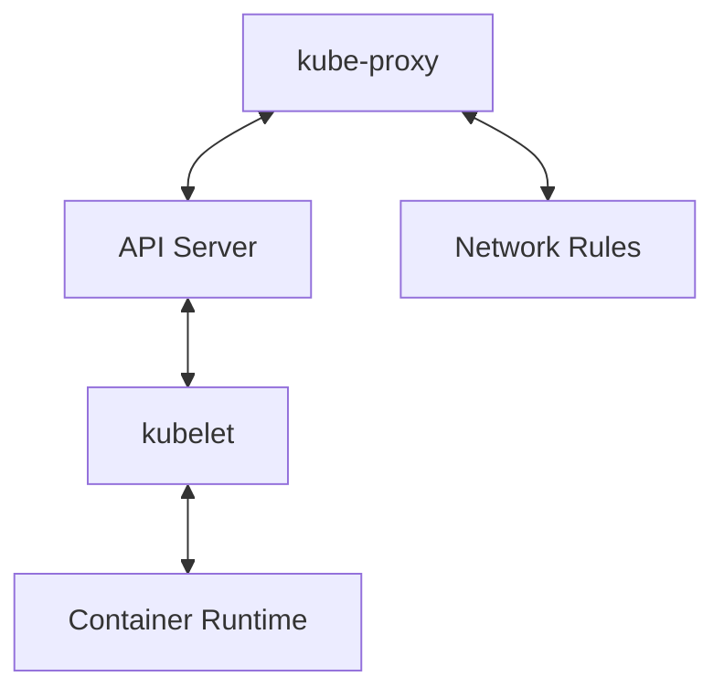

# Kubernetes Component Interaction

## Overview
This document explains how different Kubernetes components interact with each other to maintain cluster state and manage containerized applications.

## Component Communication Flow

### 1. Control Plane Communication


### 2. Worker Node Communication


## Key Interaction Scenarios

### 1. Pod Creation Flow
1. User submits Pod manifest to API Server
2. API Server validates and stores in etcd
3. Scheduler notices unscheduled Pod
4. Scheduler assigns Pod to Node
5. kubelet notices assigned Pod
6. kubelet tells Container Runtime to pull images
7. Container Runtime starts containers
8. kubelet reports status to API Server

### 2. Service Implementation
1. User creates Service
2. API Server stores Service in etcd
3. kube-proxy notices new Service
4. kube-proxy updates network rules
5. Traffic starts flowing to Pods

## Practical Example

```yaml
# Example showing component interaction
apiVersion: v1
kind: Pod
metadata:
  name: interaction-demo
spec:
  containers:
  - name: nginx
    image: nginx:latest
    ports:
    - containerPort: 80
---
apiVersion: v1
kind: Service
metadata:
  name: interaction-service
spec:
  selector:
    app: interaction-demo
  ports:
  - port: 80
    targetPort: 80
```

## Component Responsibilities

### API Server
- Central communication hub
- Authentication and authorization
- API operations and validation
- State persistence coordination

### etcd
- Stores cluster state
- Provides consistency
- Handles watch operations
- Maintains history

### Controller Manager
- Watches for changes
- Maintains desired state
- Manages controller operations
- Handles reconciliation

### Scheduler
- Pod placement decisions
- Resource tracking
- Constraint checking
- Node selection

### kubelet
- Pod lifecycle management
- Container runtime interaction
- Resource management
- Health checking

### kube-proxy
- Service implementation
- Load balancing
- Network rule management
- Endpoint management

## Best Practices

1. **Security**
   - Use TLS everywhere
   - Implement RBAC
   - Regular certificate rotation
   - Network policies

2. **Monitoring**
   - Component health checks
   - Communication latency
   - Error rates
   - Resource usage

3. **High Availability**
   - Control plane redundancy
   - etcd clustering
   - Load balancing
   - Failover configurations

## Troubleshooting

### Common Issues
1. **Communication Problems**
   - Certificate issues
   - Network connectivity
   - Port conflicts
   - Firewall rules

2. **State Inconsistencies**
   - etcd data corruption
   - Controller conflicts
   - Race conditions
   - Stale cache

### Debug Commands
```bash
# Check component status
kubectl get componentstatuses

# View system pods
kubectl get pods -n kube-system

# Check logs
kubectl logs -n kube-system <pod-name>

# View events
kubectl get events --sort-by=.metadata.creationTimestamp
```

## Advanced Topics

### 1. Leader Election
- Controller manager election
- Scheduler election
- Active-passive failover

### 2. State Reconciliation
- Desired vs actual state
- Controller loops
- Conflict resolution
- Eventually consistent model

### 3. Watch Mechanisms
- Resource version tracking
- Event notification
- Cache invalidation
- State synchronization
