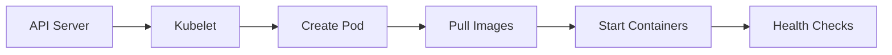

# Kubelet

## Overview
Kubelet is the primary node agent that runs on each node in the cluster. It ensures that containers are running in a Pod and healthy.

## Key Functions

1. **Pod Management**
   - Pod lifecycle management
   - Container health checks
   - Resource management
   - Volume mounting

2. **Node Management**
   - Node registration
   - Node status reporting
   - Resource monitoring

3. **Container Runtime Interface**
   - Container lifecycle management
   - Container health checks
   - Runtime communication

## Practical Example

```yaml
# Example Kubelet Configuration
apiVersion: kubelet.config.k8s.io/v1beta1
kind: KubeletConfiguration
address: 0.0.0.0
port: 10250
serializeImagePulls: true
evictionHard:
  memory.available: "100Mi"
  nodefs.available: "10%"
  nodefs.inodesFree: "5%"
maxPods: 110
authentication:
  anonymous:
    enabled: false
  webhook:
    enabled: true
authorization:
  mode: Webhook
clusterDomain: "cluster.local"
clusterDNS:
- "10.96.0.10"
```

## Docker-based Demonstration
```bash
# Run a container to simulate kubelet behavior
docker run -d \
  --name kubelet-demo \
  --privileged \
  -v /var/run/docker.sock:/var/run/docker.sock \
  -v /sys:/sys:ro \
  nginx:latest
```

## Common Operations

1. **Check Kubelet Status**
```bash
systemctl status kubelet
```

2. **View Kubelet Logs**
```bash
journalctl -u kubelet
```

3. **Check Node Status**
```bash
kubectl describe node <node-name>
```

## Pod Lifecycle Management

1. **Pod Creation Flow**


2. **Container Probes**
```yaml
apiVersion: v1
kind: Pod
metadata:
  name: probe-example
spec:
  containers:
  - name: app
    image: nginx
    livenessProbe:
      httpGet:
        path: /healthz
        port: 8080
      initialDelaySeconds: 3
      periodSeconds: 3
    readinessProbe:
      httpGet:
        path: /ready
        port: 8080
      initialDelaySeconds: 5
      periodSeconds: 5
```

## Best Practices

1. **Resource Management**
   - Set appropriate resource limits
   - Configure eviction thresholds
   - Monitor resource usage
   - Use proper QoS classes

2. **Security**
   - Enable authentication
   - Configure authorization
   - Use secure communication
   - Rotate certificates

3. **Monitoring**
   - Monitor kubelet status
   - Track container health
   - Watch resource usage
   - Log analysis

## Troubleshooting

1. **Common Issues**
   - Pod startup failures
   - Image pull errors
   - Volume mount issues
   - Resource constraints

2. **Debug Commands**
```bash
# Check kubelet logs
journalctl -u kubelet -f

# Check node conditions
kubectl describe node <node-name>

# Check pod status
kubectl describe pod <pod-name>

# Check kubelet configuration
ps aux | grep kubelet
```

## Integration with Other Components

1. **API Server**
   - Registration
   - Status updates
   - Pod specifications

2. **Container Runtime**
   - Container lifecycle
   - Image management
   - Runtime operations

3. **CNI Plugins**
   - Network setup
   - IP allocation
   - Network policy
